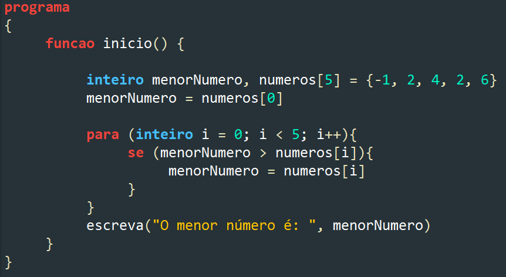
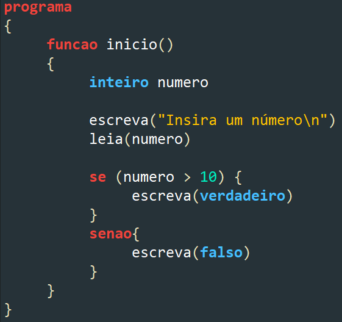
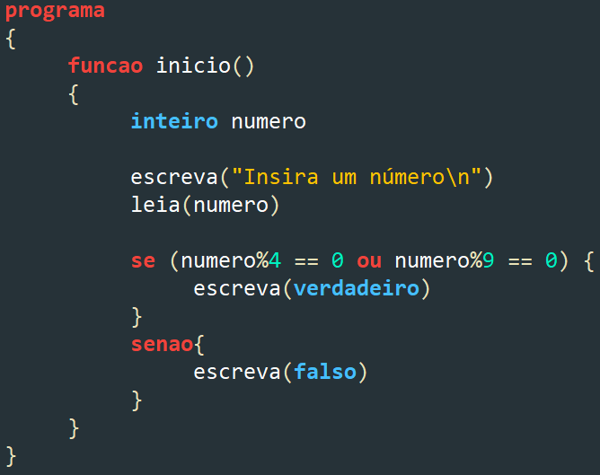
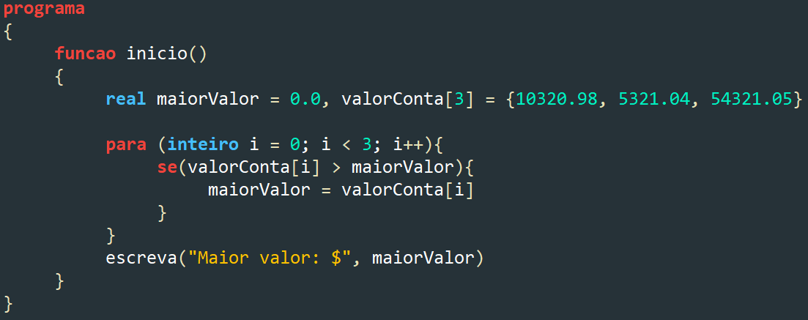
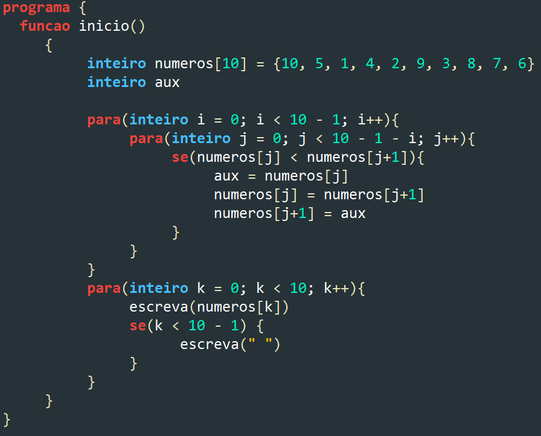
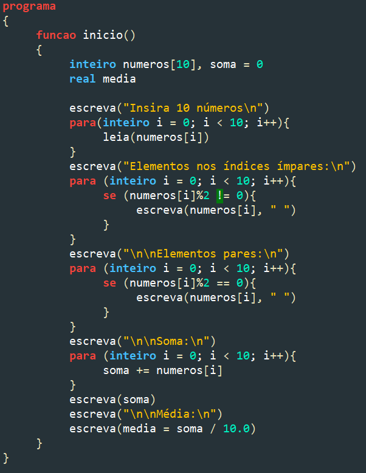

<h1>Generation Brasil</h1>
<h2>Exercícios de Portugol</h2>

<h3>Filtrar o menor:</h3>

Percorre o vetor a fim de separar o menor número nele contido:

<h3>Maior menor que 10</h3>

Verifica se o número inserido é menor ou maior que 10, retornando falso ou verdadeiro.

<h3>Divisível por 4 ou 9</h3>

Verifica se o número inserido é divisível por 4 ou 9, retornando falso ou verdadeiro.

<h3>Maior valor</h3>

Compara três valores e retorna o maior deles.

<h3>Ordenar Vetor</h3>

Ordena um vetor com números de 1 a 10, de forma que a saída saia como contagem regressiva.

<h3>Ímpar, par, soma e média</h3>

Recebe 10 números e retorna quais destes são ímpares, pares, além de fazer a soma de todos e a média

